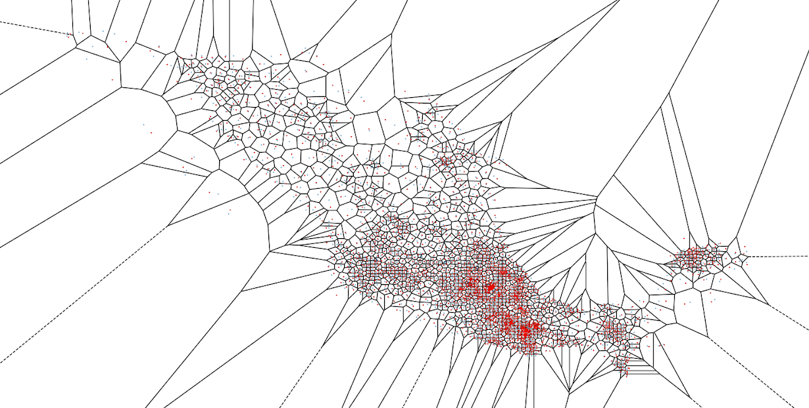

# covida19
Mobility data visualization and preparation for spatio-temporal epidemiological modeling in Mexico.

- Visualization of facebook mobility matrices, with a level 3 granularity municipalities, in QGIs.

- Match covid-19 reported cases into the mobility matrices resolution. 

